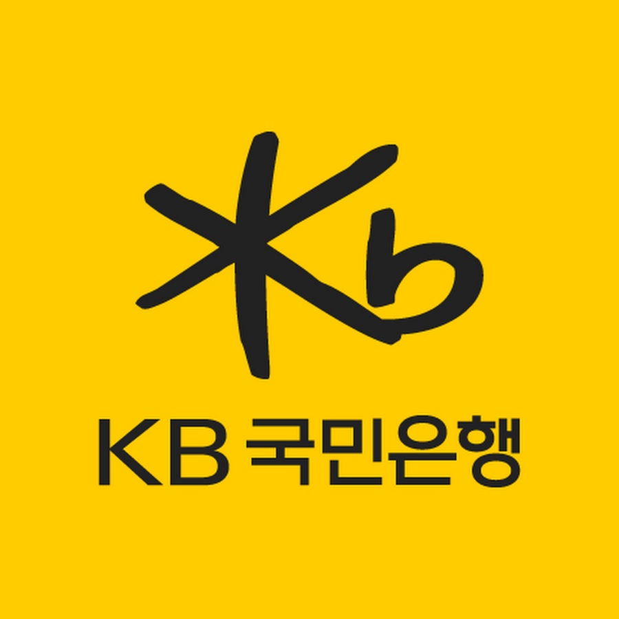
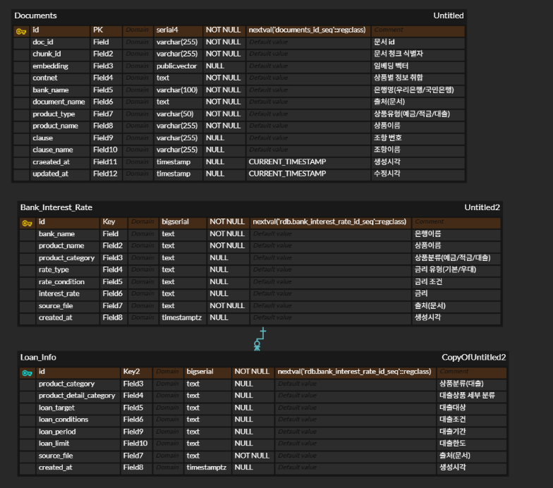
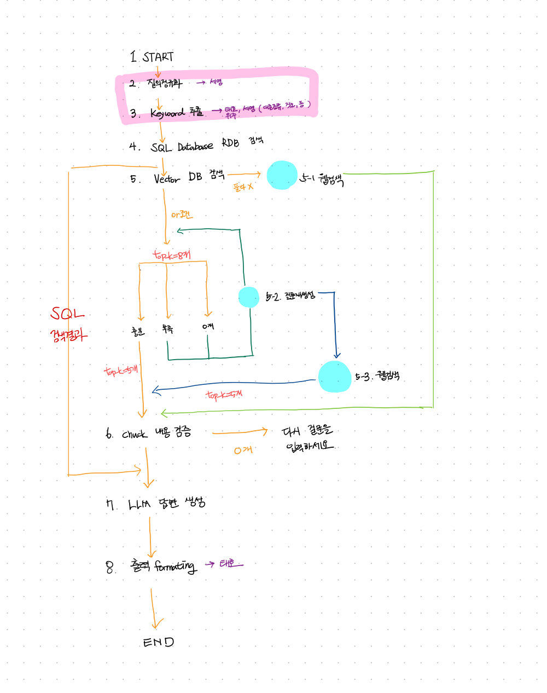
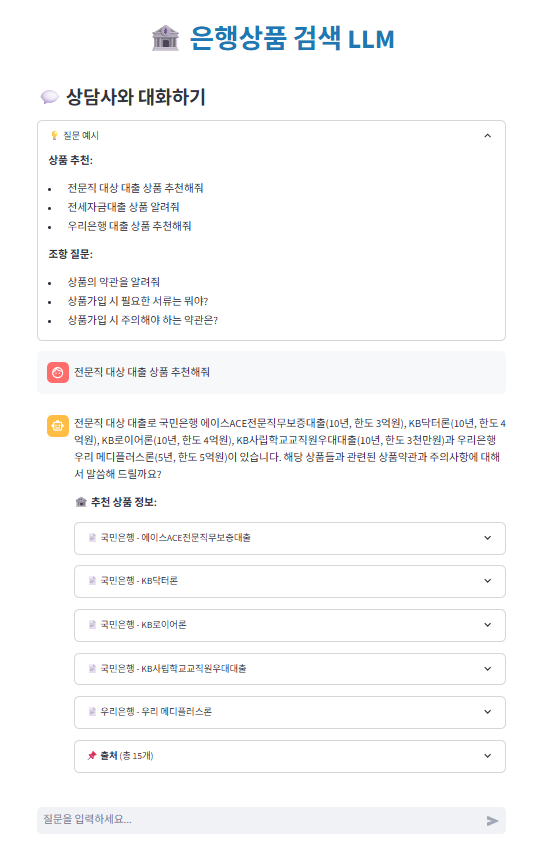
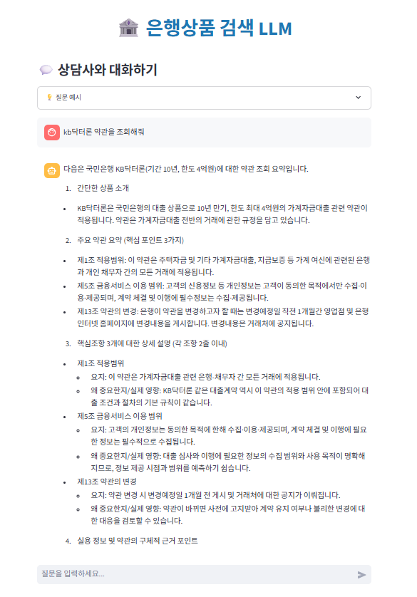
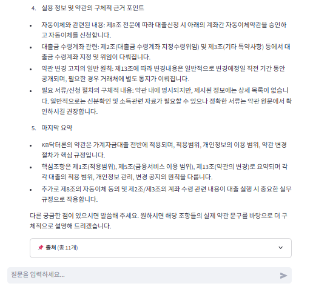

# 우리은행 + 국민은행 대출 및 예적금 Q&A RAG 서비스
> **목표:**  
>  
> 국내 시중은행의 예·적금 및 대출 상품은 은행마다 조건과 금리가 달라,  
> 사용자가 필요한 정보를 직접 비교하기 어렵습니다.  
>  
> 본 프로젝트는 **우리은행과 국민은행의 예·적금 및 대출 정보를 한곳에서 검색·비교할 수 있는 챗봇 시스템**을 목표로 합니다.  
>  
> 사용자는 “청년도약계좌 금리 알려줘”, “우리은행 전세자금대출 조건 보여줘”와 같은  
> 자연어 질의만으로 필요한 정보를 즉시 확인할 수 있습니다.  
>  
> 핵심은 **은행별 약관·금리·대출 정보를 자동으로 취합·검색하는 기능**에 있으며,  
> 이를 통해 복잡한 금융 정보를 **한눈에 명확히 이해하고 비교할 수 있는 환경**을 제공합니다.  
>  
> 궁극적으로 본 서비스는 **금융 정보 접근성을 높이고**,  
> 사용자가 **효율적이고 합리적인 금융 선택**을 할 수 있도록 지원합니다.  

---

## 구현할 서비스
- 사용자가 은행 상품에 대해 질의하면 관련 정보를 제공  
  예) “국민은행에서 청년도약계좌 상품 가입 시 필요한 서류는?”  
- 사용자의 **나이, 소득, 신용등급** 등을 고려하여 가입 가능한 상품을 추천  

---

## 서비스 필요성
- **정보 접근 어려움**: 은행 상품이 복잡하고 자격·조건 확인이 어려움  
- **상담 비용 증가**: 단순 상품 문의가 콜센터 업무의 60% 이상 차지  
- **개인화 부족**: 연령·소득별 맞춤형 상품 추천 부재  

➡️ **LLM 기반 챗봇을 통해 개인 맞춤형 금융상품 추천 및 Q&A 자동화**

---

## 4️⃣ 서비스 이점

| 구분 | 설명 |
|------|------|
| 🔍 **정확한 정보 제공** | LLM + RAG 기반으로 약관·상품설명서에서 근거 기반 답변 |
| 🤖 **지능형 고객응대** | 자연어 질의 즉시 응답 (“청년도약계좌 필요서류 알려줘”) |
| 🧠 **맞춤형 추천** | 나이·소득·신용등급 기반 상품 필터링 및 추천 |
| 📉 **운영비 절감** | FAQ 자동응대, 상담원 업무 부담 감소 |
| 💬 **고객 만족도 향상** | 추천 사유 및 근거 제공으로 신뢰도 강화 |

---

## 5️⃣ 경쟁사 대비 차별점

| 구분 | 기존 서비스 | 제안 서비스 |
|------|---------------|---------------|
| **AI 활용 범위** | 일부 은행이 자체 AI 상담 또는 추천 도입 | 다수 은행의 데이터를 통합 분석 |
| **상품 범위** | 예금/적금 중심 | 예금 + 적금 + 대출 통합 추천 |
| **출처** | 은행연합회 소비자포털 ([portal.kfb.or.kr](https://portal.kfb.or.kr/compare/loan.php))에서는 예금/적금만 비교 가능 | 통합형 LLM 챗봇으로 전 상품 비교 및 추천 가능 |

---

## <표 1> 2024년 국내 은행 AI 활용 현황

> 출처: [삼성SDS – 2025년 은행 산업의 AI 활용 전망](https://www.samsungsds.com/kr/insights/ai-in-banking-in-2025.html)

| 은행 | 주요 AI 활용 사례 |
|------|------------------|
| **NH농협은행** | • 전국 1,103개 영업점 AI 행원 배치<br>• AI 금융상품 추천 서비스(XAI) 출시<br>• 기업 대출 심사 AI 도입 |
| **신한은행** | • 150여 대 디지털 데스크 AI 행원 배치<br>• 무인점포 AI 브랜치 오픈<br>• AI 업무 비서 플랫폼 **AI ONE** 오픈<br>• 고객 분석용 노코드 플랫폼 **AI Studio** 도입<br>• 외화 송금 탐지 프로세스 AI 적용 |
| **KB국민은행** | • AI 금융비서 서비스 베타 오픈<br>• KB-STA, KB-AI OCR 부수 업무 인정<br>• 의심거래보고(STR) 프로세스에 AI 적용 |
| **우리은행** | • 생성형 AI 기반 **AI 뱅커 서비스** 출시<br>• AI 챗봇 기반 **AI 실험실(Lab)** 운영 |
| **하나은행** | • AI 기반 **기업 하이챗봇** 오픈<br>• 해외송금 예측 서비스에 AI 적용<br>• AI 수출환어음 매입 전산 자동화<br>• AI 기반 정책자금 맞춤 조회 서비스 제공 |
| **카카오뱅크** | • AI 전용 데이터센터 오픈<br>• 이상거래탐지시스템(FDS)에 XAI 적용<br>• AI 기반 개인화 추천 기능 도입<br>• AI 스미싱 문자 확인 서비스 제공 |
| **케이뱅크** | • 대안 신용평가 모형(ACSS) 고도화<br>• AI 기반 라이브 퀴즈 이벤트 진행 |
| **토스뱅크** | • 신분증 검증 자체 AI 모델 개발<br>• 생성형 AI 기반 **‘나만의 지폐 만들기’** 서비스 제공 |

---

## 🛠️ 개발 환경 및 사용 라이브러리

### Environment


### Language


### Frontend


### Backend · AI


### Data


### Storage


### Communication


---

---

### 데이터 출처
| 국민은행 | 우리은행 |
|-----------|-----------|
| <a href="https://obank.kbstar.com/quics?page=C016528" target="_blank"></a> | <a href="https://spot.wooribank.com/pot/Dream?withyou=PODEP0019" target="_blank"></a> |


## 주요 기능

- 🏦 우리은행 및 국민은행 상품 정보 검색
- 💰 대출 및 예적금 상품 Q&A
- 🔍 벡터 기반 유사도 검색 (pgvector)
- 🤖 OpenAI GPT를 활용한 자연어 답변 생성
- 📊 메타데이터 필터링 (은행명, 상품종류)
- 🐳 Docker 기반 배포

## 기술 스택

- **Language**: Python 3.11
- **Frontend/Backend**: Streamlit
- **Database**: PostgreSQL 16 + pgvector
- **Embeddings**: OpenAI text-embedding-3-large (3072차원)
- **LLM**: OpenAI gpt-5-nano
- **Vector Store**: pgvector (IVFFLAT/HNSW)
- **Framework**: LangChain + LangGraph
- **Deployment**: Docker Compose

## 프로젝트 구조

```
SKN18-3rd-3Team/
├── app.py                                  # 메인 애플리케이션
├── docker-compose.yml                      # Docker Compose 설정
├── README.md                               # 프로젝트 구조 및 설명
├── Start.md                                # 프로젝트 실행 준비 및 과정
├── .env                                    # 환경 변수 (LLM 설정 추가)
│
├── rag/                                    # RAG 시스템 핵심 모듈
│   ├── core/                               # 핵심 설정
│   │   ├── config.py                       # 환경 설정 (LLM 모델 분리)
│   │   ├── logger.py                       # 프로젝트 로그 저장 및 출력
│   │   └── singleton.py                    # 싱글톤 class 정의
│   │
│   ├── llm/                                # LLM 모듈
│   │   └── get_llm.py                      # 생성용/평가용 LLM 호출
│   │
│   ├── embeddings/                         # 임베딩 모듈
│   │   ├── openai_embed.py                 # OpenAI Embeddings (1536차원)
│   │   └── provider.py                     # 임베딩 provider 인터페이스 정의
│   │
│   ├── vectorstore/                        # 벡터 저장소
│   │   ├── pgvector_store.py               # PostgreSQL + pgvector
│   │   └── sql.py                          # 3072차원
│   │
│   ├── db/                                 # 데이터베이스
│   │   ├── connection.py                   # DB 연결 관리
│   │   └── repo.py                         # DB 레포지토리
│   │
│   ├── ingestion/                          # 데이터 수집
│   │   ├── load_csv.py                     # 은행 약관/대출정보/금리 문서 로드
│   │   └── indexer.py                      # 문서 리스트를 받아 벡터스토어(DB)에 추가
│   │
│   ├── graph/                              # LangGraph 구조
│   │   ├── build.py                        # LangGraph node-edge 연결 및 조건분기(구성)
│   │   ├── State.py                        # 사용자 정의 State
│   │   │
│   │   ├── multiAgent/                       # Multi-Agent 시스템
│   │   │   ├── classify_agent.py             # 분류 에이전트
│   │   │   ├── sql_agent.py                  # SQL 검색 에이전트
│   │   │   ├── eval_agent.py                 # 웹 검색/vectordb 검색 결과 평가 및 선택
│   │   │   └── gen_agent.py                  # 답변 취합 및 생성
│   │   │
│   │   ├── nodes/                            # LangGraph 노드들
│   │   │   ├── classify_node.py              # 분류 노드
│   │   │   ├── search_sql_node.py            # SQL 검색 노드
│   │   │   ├── search_vectordb_node.py       # 벡터 검색 노드
│   │   │   ├── search_web_node.py            # 웹 검색 노드
│   │   │   ├── eval_node.py                  # 웹 검색/vectordb 검색 결과 평가 및 선택 노드
│   │   │   ├── generate_answer_node.py       # 답변 생성 노드
│   │   │   ├── format_response_node.py       # 응답 포맷팅 노드
│   │   │   ├── response_formatting_node.py   # 응답 포맷팅 노드
│   │   │   └── rewrite_query_node.py         # 쿼리 재작성 노드
│   │   │
│   │   └── route/                            # 라우팅 로직
│   │       ├── __init__.py
│   │       ├── route_classify.py             # 분류 기반 라우팅
│   │       └── route_eval.py                 # 평가 기반 라우팅
│   │
│   └── langsmith/                            # LangSmith 모니터링
│       ├── tracer.py                         # 트레이싱 설정
│       └── utils.py                          # 유틸리티 함수
│  
│  
├── scripts/                          # 실행 스크립트
│   ├── index_data.py                 # 은행 데이터를 벡터스토어에 적재
│   ├── test.py                       # RAG 테스트, 임계값 35.0
│   └── visualize_graph.py            # 그래프 시각화
│
├── data/                             # 데이터 파일
│   ├── final_embedding_data_v7.csv   # Vector DB용 데이터 (8,097개 청크)
│   └── RDB/                          # RDB용 데이터
│       ├── bank_rate.csv             # 은행 금리 데이터
│       └── loan_products_RDB.csv     # 대출 상품 데이터
│
└── docker/                           # Docker 설정
    ├── Dockerfile.app                # 앱 Dockerfile
    ├── requirements.txt                        # Python 패키지 의존성
    └── initdb/                       # DB 초기화 스크립트
        ├── 01_init.sql         # PostgreSQL 확장
        ├── bank_rate.csv             # 금리 데이터
        ├── final_embedding_data_v7.csv   # 임베딩 데이터
        └── loan_products_RDB.csv     # 대출 상품 데이터
```

## Vector Database, Relational Database 설계
---




## 프로젝트 설계
---



---
                             작동 방식

                      ┏ ━ ━ ━ ━ ━ ━ ━ ━ ━ ━ ━ ┓
                      ┃         Start         ┃
                      ┗ ━ ━ ━ ━ ━ ━ ━ ━ ━ ━ ━ ┛
                                 🔽
                      ┏ ━ ━ ━ ━ ━ ━ ━ ━ ━ ━ ━ ┓
                      ┃       질의정규화       ┃
                      ┗ ━ ━ ━ ━ ━ ━ ━ ━ ━ ━ ━ ┛
                                 🔽
                      ┏ ━ ━ ━ ━ ━ ━ ━ ━ ━ ━ ━ ┓
                      ┃      Keyword 추출     ┃
                      ┗ ━ ━ ━ ━ ━ ━ ━ ━ ━ ━ ━ ┛
                                 🔽
                      ┏ ━ ━ ━ ━ ━ ━ ━ ━ ━ ━ ━ ┓
                      ┃ SQL Database RDB 검색 ┃
                      ┗ ━ ━ ━ ━ ━ ━ ━ ━ ━ ━ ━ ┛
            ┏━━━━━━━━━━━━━━━━━━━━🔽
            ┃         ┏ ━ ━ ━ ━ ━ ━ ━ ━ ━ ━ ━ ┓
            ┃         ┃     Vector DB 검색    ┃
            ┃         ┗ ━ ━ ━ ━ ━ ━ ━ ━ ━ ━ ━ ┛
            ┃                     ┃                        
                                  ┃ ◀━━━━━━━━━━━━━━━━━┓
            S                     ┃                    ┃
            Q                top_k = 8개        ┏ ━ ━ ━ ━ ━━ ┓  
            L           ┏━━━━━━━━━╋━━━━━━━━━┓   ┃ 질문재생성 ┣━━━┓
                        ┃         ┃         ┃   ┗ ━━ ━ ━ ━ ━ ┛   ┃  
           검          충분      부족      0개         ┃          ┃
           색           ┃         ┃         ┃          ┃         ┃
           결           ┃         ┗━━━━━━━━━┻━━━━━━━━━━┛         ┃
           과           ┃                                        ▼
                   top_k = 4개                            ┏ ━ ━ ━ ━ ━━ ┓  
            ┃           ┃ ◀━━━━━━━━━━━━━━━━━━━━━━━━━━━━━━━┫   웹검색   ┃
            ┃           ┃                                 ┗ ━━ ━ ━ ━ ━ ┛ 
            ┃           ┃
            ┃           ┃
            ┃           ┃
            ┃           ┗━━━━━━━━━┓
            ┃                     ▼
            ┃         ┏ ━ ━ ━ ━ ━ ━ ━ ━ ━ ━ ━ ┓
            ┃         ┃    Chunk 내용 검증    ┣━━━━━━━▶ 다시 질문을 입력하세요!
            ┃         ┗ ━ ━ ━ ━ ━ ━ ━ ━ ━ ━ ━ ┛
            ┗━━━━━━━━━━━━━━━━━━▶ 🔽
                      ┏ ━ ━ ━ ━ ━ ━ ━ ━ ━ ━ ━ ┓
                      ┃     LLM 답변 생성     ┃
                      ┗ ━ ━ ━ ━ ━ ━ ━ ━ ━ ━ ━ ┛
                                 🔽
                      ┏ ━ ━ ━ ━ ━ ━ ━ ━ ━ ━ ━ ┓
                      ┃     출처 Fomatting    ┃
                      ┗ ━ ━ ━ ━ ━ ━ ━ ━ ━ ━ ━ ┛
                                 🔽
                      ┏ ━ ━ ━ ━ ━ ━ ━ ━ ━ ━ ━ ┓
                      ┃         E N D         ┃
                      ┗ ━ ━ ━ ━ ━ ━ ━ ━ ━ ━ ━ ┛


## 데이터 적재 파이프라인 (프로젝트 반영 버전)

1. **CSV → LangChain Document**
   - 원본: `data/final_embedding_data_v4.csv` (현재 스크립트 기본값)
   - 필수 컬럼: `chunk_id`, `doc_id`, `은행명`, `상품종류`, `상품이름`, `조항`, `조항이름`, `조항내용`
   - 구현: `rag/ingestion/load_csv.py`
     - 본문: `조항내용` → 없으면 `context`/`text`
     - 유효성: 공백/NaN/10자 미만 본문은 스킵
     - 메타데이터: `chunk_id`, `doc_id`, `은행명`, `상품종류`, `상품이름`, `조항`, `조항이름`

2. **임베딩 생성 (OpenAI)**
   - 파일: `rag/embeddings/openai_embed.py`
   - 모델: `.env`의 `EMBED_MODEL` (예: `text-embedding-3-large`)
   - 설정: `OPENAI_API_KEY`, `OPENAI_TIMEOUT`

3. **PgVector 저장 (Upsert)**
   - 테이블: `documents` (초기 스키마 `docker/initdb/02_schema.sql`)
   - SQL 템플릿: `rag/vectorstore/sql.py`
   - 메타 인덱스: `은행명`, `상품종류` 등 기본 인덱스 포함
   - 보조 스키마/데이터: `docker/initdb/03_rdb_load.sql`에서 `rdb.loan_info`, `rdb.bank_interest_rate` 자동 적재

4. **인덱싱 실행 (`scripts/index_data.py`)**
   - 필요: DB 컨테이너 기동 (`docker compose up -d`)
   - 실행: `docker compose exec app python scripts/index_data.py`
   - 기본 CSV 경로는 스크립트 내에서 `./data/final_embedding_data_v4.csv`
   - 배치 처리, 진행 로그, 최종 문서 수 출력

5. **벡터 인덱스(선택)**
   - 대량 데이터 시 COPY 후 생성 권장
   - IVFFLAT:
     ```
     CREATE INDEX IF NOT EXISTS documents_embedding_idx
       ON documents USING ivfflat (embedding vector_cosine_ops)
       WITH (lists = 100);
     ```
   - HNSW:
     ```
     CREATE INDEX IF NOT EXISTS documents_embedding_idx
       ON documents USING hnsw (embedding vector_cosine_ops)
       WITH (m = 16, ef_construction = 64);
     ```

6. **적재 검증**
   - 컨테이너 내부에서 문서 수 확인:
     ```
     docker compose exec db psql -U postgres -d rag -c "SELECT COUNT(*) FROM documents;"
     ```

---

## 노드/에이전트 구성 (route 폴더 제외 최신 구조 기준)

### Nodes (`rag/graph/nodes`)
1. **`classify_node.py`**
   - `run_intent_agent` 호출 → intent, 은행, 상품명 등 추출 후 상태에 저장.
   - LLM confidence가 낮으면 규칙 기반 fallback 적용 기록을 함께 남깁니다.

2. **`search_sql_node.py`**
   - intent가 금융 관련(`rate_fee_lookup`, `clause_lookup`, `compare`, `definition`)이고 confidence ≥ 0.5일 때만 `SQLRetrievalAgent.run` 호출.
   - `sql_results`, `sql_contents`, `debug["sql"]`에 SQL/금리 정보를 정리해 넣습니다.
   - 조건 미달이면 SQL을 스킵하고 빈 결과를 반환합니다.

3. **`search_vectordb_node.py`**
   - PgVector 기반 유사도 검색. SQL 결과 또는 분류 키워드를 활용해 쿼리를 구성합니다.
   - 검색 결과를 LangChain Document → dict 형태로 변환해 `vector_chunks` 등에 저장합니다.

4. **`eval_node.py`**
   - `EvaluationAgent.run` 호출로 각 청크의 관련성(점수+YES/NO)을 평가.
   - 임계값(`relevance_threshold`) 미만 청크 제거, 디버그에 점수/판정 기록.

5. **`generate_answer_node.py` & `format_response_node.py`**
   - `GenerationAgent.run`으로 SQL 요약 + 관련 청크를 조합해 답변 생성.
   - `format_response`에서 출력 구조(답변, 참고 소스 등)를 정리하고 그래프를 종료합니다.

### Multi-Agent (`rag/graph/multiAgent`)
1. **`classify_agent.py`**
   - LLM으로 intent, bank_name, product_name, loan_type, loan_target, clause_keywords 추출.
   - 규칙 기반 fallback과 키워드 토큰화(`raw_keywords`)로 downstream LIKE 검색을 보조합니다.

2. **`sql_agent.py` (`SQLRetrievalAgent`)**
   - `rdb.loan_info`에서 상품 후보, `rdb.bank_interest_rate`에서 금리 정보를 결합.
   - `selection_reason`, `interest_rates`, `loan_info_match` 같은 필드를 구성하고, intent/신뢰도 검사를 통해 무관한 질문을 필터링합니다.
   - `product_keywords`가 없을 경우에도 fallback으로 금리 테이블 검색을 수행합니다.

3. **`eval_agent.py`**
   - Vector 검색 결과 청크를 LLM으로 평가(0~100, YES/NO).
   - 임계값 이상 청크만 `relevant_chunks`로 유지하여 생성 단계의 품질을 높입니다.

4. **`gen_agent.py`**
   - SQL 요약과 청크를 사용해 최종 답변 텍스트를 생성하고, 출처(`sources`)를 함께 제공합니다.


# 프로젝트 실행

## 사용 방법

### 웹 인터페이스

1. 브라우저에서 `http://localhost:8501` 접속
2. 질문 입력창에 질문 작성
3. 사이드바에서 검색 옵션 설정 (선택사항):
   - 은행 선택: 자동 감지 / 우리은행 / 국민은행
   - 상품 종류: 자동 감지 / 대출 / 예적금
   - 검색 문서 수: 3~15개
4. "🔍 검색" 버튼 클릭
5. 답변 및 참고 문서 확인

### 질문 예시

- "국민은행 대출 금리는 어떻게 되나요?"
- "우리은행 예금 상품에는 어떤 것이 있나요?"
- "중도상환수수료는 얼마인가요?"
- "대출 한도는 어떻게 결정되나요?"
- "금리 우대 조건은 무엇인가요?"

## 실행 화면

## 🏦 상담사와 대화하기 — 상품 추천 페이지



> 이 페이지는 사용자가 자연어로 질문을 입력하면,  
LLM이 관련 은행 상품(예금, 적금, 대출 등)을 **자동 검색·요약·추천**해주는 메인 대화 화면입니다. 

>예를 들어 “전문직 대상 대출 상품 추천해줘” 또는 “전세자금대출 상품 알려줘”와 같은 질의에 대해 해당 조건에 맞는 국민은행·우리은행 상품을 제시합니다.

---

### 🧩 주요 구성 요소

#### 🟣 질문 예시 안내 박스
- **상품 추천형 예시:**  
  - “전문직 대상 대출 상품 추천해줘”  
  - “전세자금대출 상품 알려줘”  
- **조항 질의형 예시:**  
  - “상품의 약관을 알려줘”  
  - “상품가입 시 주의해야 하는 약관은?”

#### 💬 사용자 입력창
- 사용자가 직접 자연어로 질문을 입력할 수 있습니다.  
- 예시: “KB닥터론 약관 알려줘”, “우리은행 대출 추천해줘”

#### 🧠 LLM 응답 카드
- **첫 번째 응답:** 추천된 상품의 핵심 요약  
- **두 번째 응답:** 관련 상품 리스트 (은행별 접이식 아코디언 형태)

#### 📑 결과 요약
- 각 추천 상품을 클릭하면 세부 조건 및 약관 정보를 바로 확인할 수 있습니다.  
- LLM이 상품 설명서와 약관 문서에서 **근거 문장**을 추출해 자연어로 요약합니다.

#### 📚 출처 표시
- RAG 검색을 통해 참조한 문서의 개수를 명시합니다.  
  *(예: “출처 (총 15개)”)*
  
---

### ✨ 특징

- **통합 비교:** 여러 은행(국민은행, 우리은행 등)의 상품을 한 번에 비교 가능  
- **정보 집약:** 상품명, 조건, 금리 정보를 한눈에 확인 가능  
- **근거 기반 요약:** “상품명 + 약관 + 추천 근거”를 자연어로 정리해 제공  
- **사용자 친화성:** 질문 한 번으로 복잡한 금융 정보를 직관적으로 이해 가능  

---

## 📜 상담사와 대화하기 — 약관 요약 페이지




> 이 페이지는 사용자가 특정 상품의 약관을 요청했을 때,  
LLM이 해당 상품의 약관 조항을 분석하여 **핵심 내용만 요약 정리**해 보여주는 화면입니다.  
  
>대출 기간·한도 등 기본 상품 정보와 함께 제13조(약관 변경), 제6조(금융서비스 이용 범위) 등의 핵심 조항 요약이 단계적으로 제공됩니다.

---

### 🧩 주요 구성 요소

#### 📘 상품 요약
- 해당 상품의 이름, 만기, 한도 등 기본 정보를 요약 표시  
- 예시: KB버터론 (기간 10년, 한도 4억 원)

#### 📜 약관 요약
- **핵심 포인트(3~4개 조항)** 를 중심으로 간결하게 정리  
- 각 조항에는 ‘요지’, ‘중요한 이유’, ‘적용 범위’가 포함됨  
- 예시:  
  - 제13조 약관의 변경  
  - 제6조 금융서비스 이용범위  
  - 제15조 신청내용의 변경 및 해지신고

#### 💡 요약 설명
- LLM이 약관 문서 내 중요 조항을 자동 추출하고  
  그 의미를 **일반 사용자가 이해하기 쉬운 언어로 변환**하여 제공  
- 공식 문서 기반의 요약임을 명시하여 **신뢰성 확보**

#### 📚 관련 근거
- RAG 기반으로 약관 PDF에서 추출된 실제 문장과 연결  
- “관련 약관 정보 (총 n개)” 형태로 표시되어,  
  사용자가 원문 문서로 바로 이동 가능  

---

### ✨ 특징

- **약관 자동 요약:** LLM이 공식 문서의 주요 조항을 핵심만 발췌  
- **법적 근거 기반:** 조항별 적용 사유 및 영향 명확히 제시  
- **이해도 향상:** 복잡한 약관을 자연어 요약으로 간결히 설명  
- **신뢰성 확보:** 원문 출처 명시로 정보의 투명성 강화  


## 개발

### 코드 구조

- **Core 모듈**: 설정, 로깅, 싱글톤 패턴
- **Database 모듈**: PostgreSQL 연결 및 CRUD
- **Embeddings 모듈**: OpenAI 임베딩 생성
- **LLM 모듈**: OpenAI GPT 답변 생성
- **VectorStore 모듈**: pgvector 기반 벡터 검색
- **Ingestion 모듈**: CSV 로딩 및 인덱싱
- **RAG 모듈**: 검색 및 생성 파이프라인

### 로깅

시스템은 자동으로 로그를 출력합니다:
- 인덱싱 진행 상황
- 검색 쿼리 및 결과
- 에러 및 경고 메시지
- 데이터베이스 연결 상태


# 후기
이태호(팀장) : 
박세영 :
임승옥 :
최준호 :
김영우 :
김창현 :
